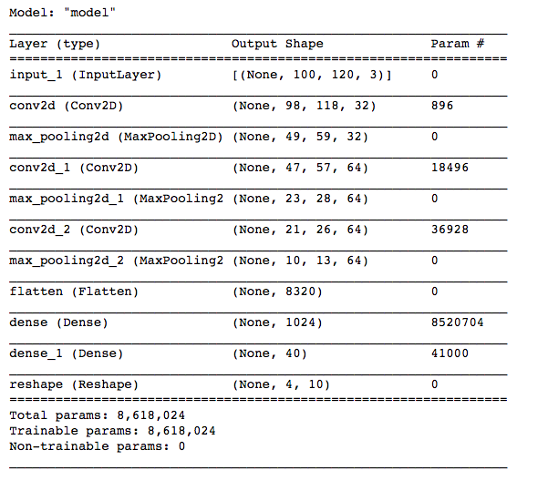

# Captcha Solving Using TensorFlow


## Introduction

1. Solve captcha using TensorFlow.
2. Learn CNN and TensorFlow by a practical project.

Follow the steps,
run the code,
and it works!

the accuracy of 4 digits version can be as high as 99.8%!

There are several more steps to put this prototype on production.

**Ping me for paid technical supports**.

[i@jackon.me](mailto:i@jackon.me)


## Solve Captcha Using CNN Model


old code that using tensorflow 1.x is moved to [tensorflow_v1](tensorflow_v1).

#### 4-digits Captcha

```bash
# generating test data
$ python datasets/gen_captcha.py -d --npi=4 -n 6
```

- Model: AlexNet
- datasets:
    - training images: 21k
    - testing images: 9k
- Accuracy: 87.6%

if we increase the dataset by 10x, the accuracy increases to 98.8%.
we can further increase the accuracy to 99.8% using 1M traning images.

here is the source code and running logs: [captcha-solver-tf2-4digits-AlexNet-98.8.ipynb](captcha-solver-tf2-4digits-AlexNet-98.8.ipynb)

Images, Ground Truth and Predicted Values:

there is 1 predicton error out of the 20 examples below. 9871 -> 9821


Accuracy and Loss History:


Model Structure:

- 3 convolutional layers, followed by 2x2 max pooling layer each.
- 1 flatten layer
- 2 dense layer




## Generate DataSet for Training

#### Usage

```bash
$ python datasets/gen_captcha.py  -h
usage: gen_captcha.py [-h] [-n N] [-t T] [-d] [-l] [-u] [--npi NPI]
                      [--data_dir DATA_DIR]

optional arguments:
  -h, --help           show this help message and exit
  -n N                 epoch number of character permutations.
  -t T                 ratio of test dataset.
  -d, --digit          use digits in dataset.
  -l, --lower          use lowercase in dataset.
  -u, --upper          use uppercase in dataset.
  --npi NPI            number of characters per image.
  --data_dir DATA_DIR  where data will be saved.
```

examples:


#### Example 1: 1 character per captcha, use digits only.

1 epoch will have 10 images, generate 2000 epoches for training.

generating the dataset:

```bash
$ python datasets/gen_captcha.py -d --npi 1 -n 2000
10 choices: 0123456789
generating 2000 epoches of captchas in ./images/char-1-epoch-2000/train
generating 400 epoches of captchas in ./images/char-1-epoch-2000/test
write meta info in ./images/char-1-epoch-2000/meta.json
```

preview the dataset:

```bash
$ python datasets/base.py images/char-1-epoch-2000/
========== Meta Info ==========
num_per_image: 1
label_choices: 0123456789
height: 100
width: 60
n_epoch: 2000
label_size: 10
==============================
train images: (20000, 100, 60), labels: (20000, 10)
test images: (4000, 100, 60), labels: (4000, 10)
```

#### Example 2: use digits/lower/upper cases, 2 digit per captcha image

1 epoch will have `62*61=3782` images, generate 10 epoches for training.

generating the dataset:

```bash
$ python datasets/gen_captcha.py -dlu --npi 2 -n 10
62 choices: 0123456789abcdefghijklmnopqrstuvwxyzABCDEFGHIJKLMNOPQRSTUVWXYZ
generating 10 epoches of captchas in ./images/char-2-epoch-10/train
generating 2 epoches of captchas in ./images/char-2-epoch-10/test
write meta info in ./images/char-2-epoch-10/meta.json
```

preview the dataset:

```bash
========== Meta Info ==========
num_per_image: 2
label_choices: 0123456789abcdefghijklmnopqrstuvwxyzABCDEFGHIJKLMNOPQRSTUVWXYZ
height: 100
width: 80
n_epoch: 10
label_size: 62
==============================
train images: (37820, 100, 80), labels: (37820, 124)
test images: (7564, 100, 80), labels: (7564, 124)
```


#### Example 3: use digits, 4 chars per captcha image

1 epoch has `10*9*8*7=5040` images, generate 10 epoches for training.

generating the dataset:

```bash
$ python datasets/gen_captcha.py -d --npi=4 -n 6
10 choices: 0123456789
generating 6 epoches of captchas in ./images/char-4-epoch-6/train
generating 1 epoches of captchas in ./images/char-4-epoch-6/test
write meta info in ./images/char-4-epoch-6/meta.json
```

preview the dataset:

```bash
$ python datasets/base.py images/char-4-epoch-6/
========== Meta Info ==========
num_per_image: 4
label_choices: 0123456789
height: 100
width: 120
n_epoch: 6
label_size: 10
==============================
train images: (30240, 100, 120), labels: (30240, 40)
test images: (5040, 100, 120), labels: (5040, 40)
```
